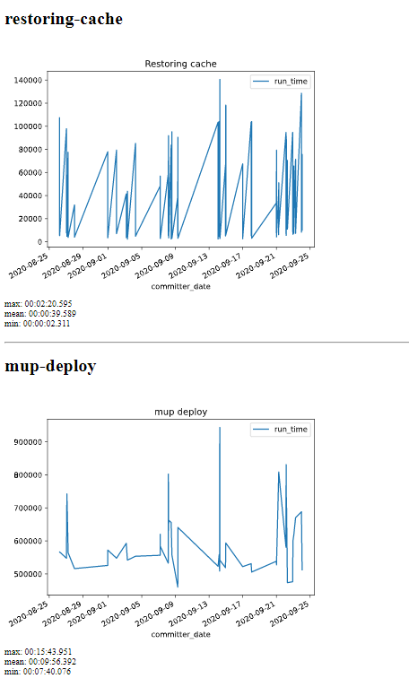

# CircleCI Stats

[](https://tducasse.com/posts/the-weekend-project)

CircleCI doesn't give _super useful_ stats about build times over time.

I wanted to see if our builds were getting slower (or faster), which jobs were taking a lot of time, etc.

So here's a CLI that calls the circle API, builds some pretty graphs, and wraps them in an html page.

## Install

```sh
git clone https://github.com/tducasse/circleci-stats.git
cd circleci-stats
# I tested it with Python 3.8
pip install -r requirements.txt
```

## Run

### Params

This script uses [python-dotenv](https://pypi.org/project/python-dotenv/), so everything is handled with env variables, and you can choose whether you want to store them in your environment directly or in a `.env` file.

```sh
# .env

# get an API token from circle
TOKEN=your_circle_token
# just so that we don't fetch every job on every branch 😬
BRANCH=develop
# just get jobs for this workflow
WORKFLOW=deploy-develop
# project slug in circleci
PROJECT=gh/username/repo_name
# number of builds to fetch from the API
LIMIT=50
# use this if you use WSL on windows
WSL_ROOT=$wsl/Ubuntu
```

### Actually run

```
python main.py
```

## What it looks like


